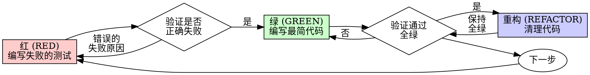

# 测试驱动开发 (TDD)

## 概述

先写测试。观察它失败。编写最少代码使之通过。

**核心原则：** 如果你没亲眼看到测试失败，你就不知道它是否测试了正确的内容。

**违反规则的字面意思就是违反规则的精神。**

## 何时使用

**始终：**
- 新功能
- Bug 修复
- 重构
- 行为更改

**例外情况（请询问您的人类伙伴）：**
- 抛弃型原型 (Throwaway prototypes)
- 生成的代码
- 配置文件

想过“就这一次跳过 TDD”吗？停下来，那只是在自我辩解。

## 铁律

```
没有失败测试，严禁编写生产代码
```

在测试之前写了代码？删掉它，重新开始。

**没有例外：**
- 不要把它留作“参考”
- 不要编写测试时“改编”它
- 不要看它
- “删除”就是真正的删除

从测试开始重新实施。就是这样。

## 红-绿-重构 (Red-Green-Refactor)



### 红 (RED) —— 编写失败的测试

编写一个最简测试来展示应该发生什么。

<好的示例>
```typescript
test('失败的操作重试 3 次', async () => {
  let attempts = 0;
  const operation = () => {
    attempts++;
    if (attempts < 3) throw new Error('fail');
    return 'success';
  };

  const result = await retryOperation(operation);

  expect(result).toBe('success');
  expect(attempts).toBe(3);
});
```
名称清晰，测试真实行为，只测一件事。
</好的示例>

<坏的示例>
```typescript
test('重试有效', async () => {
  const mock = jest.fn()
    .mockRejectedValueOnce(new Error())
    .mockRejectedValueOnce(new Error())
    .mockResolvedValueOnce('success');
  await retryOperation(mock);
  expect(mock).toHaveBeenCalledTimes(3);
});
```
名称模糊，测试的是 mock 而不是代码。
</坏的示例>

**要求：**
- 单一行为
- 名称清晰
- 真实代码（除非不可避免，否则不要使用 mock）

### 验证红灯 —— 观察其失败

**强制性要求。绝不要跳过。**

```bash
npm test path/to/test.test.ts
```

确认：
- 测试失败（而不是由于语法错误报错）
- 失败信息符合预期
- 失败是因为缺少功能（而不是拼写错误）

**测试通过了？** 说明你正在测试现有的行为。请修正测试。

**测试报错了？** 修正错误，重新运行直到它正确地“失败”。

### 绿 (GREEN) —— 编写最简代码

编写使测试通过的最简单代码。

<好的示例>
```typescript
async function retryOperation<T>(fn: () => Promise<T>): Promise<T> {
  for (let i = 0; i < 3; i++) {
    try {
      return await fn();
    } catch (e) {
      if (i === 2) throw e;
    }
  }
  throw new Error('unreachable');
}
```
足以通过测试即可。
</好的示例>

<坏的示例>
```typescript
async function retryOperation<T>(
  fn: () => Promise<T>,
  options?: {
    maxRetries?: number;
    backoff?: 'linear' | 'exponential';
    onRetry?: (attempt: number) => void;
  }
): Promise<T> {
  // 违背了 YAGNI 原则
}
```
过度工程化。
</坏的示例>

不要添加功能、重构其他代码或进行超出测试范围的“改进”。

### 验证绿灯 —— 观察其通过

**强制性要求。**

```bash
npm test path/to/test.test.ts
```

确认：
- 测试通过
- 其他测试依然通过
- 输出整洁（无错误、无警告）

**测试失败了？** 修正代码，而不是测试。

**其他测试失败了？** 立即修复。

### 重构 (REFACTOR) —— 清理代码

仅在绿灯后进行：
- 消除重复
- 优化命名
- 提取辅助函数

保持测试为绿灯。不要添加新行为。

### 重复

为下一个功能编写下一个失败测试。

## 优秀测试的标准

| 品质 | 好的 | 坏的 |
|---------|------|-----|
| **最简** | 只测一件事。名称中有“和”？拆分它。 | `test('验证邮箱和域名及空格')` |
| **清晰** | 名称描述行为 | `test('测试1')` |
| **展示意图** | 演示理想的 API | 掩盖了代码应该做的功能 |

## 为什么顺序很重要

**“我会事后写测试来验证它是否有效”**

在代码之后编写的测试会立即通过。立即通过证明不了任何事情：
- 可能测试了错误的内容
- 可能测试的是实现细节而非行为
- 可能遗漏了你忘记的边缘情况
- 你从未见过它捕捉到 bug

先写测试强制你看到测试失败，证明它确实在测试某些东西。

**“我已经手动测试了所有边缘情况”**

手动测试是即兴的。你认为你测试了一切，但是：
- 没有你测试过什么的记录
- 代码更改时无法重新运行
- 在压力下容易遗漏情况
- “我尝试时它有效” ≠ 全面

自动化测试是系统性的。它们每次运行的方式都一样。

**“删掉 X 小时的工作是浪费”**

沉没成本谬误。时间已经流逝了。你现在的选择是：
- 删除并使用 TDD 重写（再花 X 小时，高度自信）
- 保留它并在事后添加测试（30 分钟，低度自信，可能有 bug）

真正的“浪费”是保留你无法信任的代码。没有真实测试的运行代码就是技术债。

**“TDD 太教条了，务实意味着灵活应变”**

TDD **就是** 务实的：
- 在提交前发现 bug（比事后调试更快）
- 防止回归（测试能立即发现破坏点）
- 记录行为（测试展示了如何使用代码）
- 支持重构（自由更改，测试会捕捉破坏点）

“务实”的捷径 = 在生产环境中调试 = 更慢。

**“事后测试能达到同样的目标 —— 重要的是精神而非仪式”**

不。事后测试回答的是“这段代码做了什么？”，而先写测试回答的是“这段代码应该做什么？”。

事后测试会受到你实现的干扰。你测试的是你构建出的东西，而不是所要求的东西。你验证的是你记起的边缘情况，而不是发现的边缘情况。

先写测试强制在实施前发现边缘情况。事后测试验证你记起了一切（其实你没有）。

事后补 30 分钟测试 ≠ TDD。你得到了覆盖率，却失去了测试有效的证明。

## 借口与事实

| 借口 | 事实 |
|--------|---------|
| “太简单了，不需要测试” | 简单的代码也会崩溃。写测试只需 30 秒。 |
| “我稍后会测试” | 立即通过的测试证明不了任何事情。 |
| “事后测试效果一样” | 事后测试 = “做了什么？”，先写测试 = “该做什么？” |
| “已经手动测试过了” | 即兴 ≠ 系统。无记录，无法重复运行。 |
| “删除 X 小时工作太浪费” | 沉没成本谬误。保留未经验证的代码是技术债。 |
| “留作参考，先写测试” | 你会去适配它，那就是事后测试。删除就是删除。 |
| “需要先进行探索” | 没问题。丢掉探索代码，从 TDD 开始正式实施。 |
| “测试太难 = 设计不清晰” | 听从测试的反馈。难测 = 难用。 |
| “TDD 会减慢我的速度” | TDD 比调试更快。务实 = 先写测试。 |
| “手动测试更快” | 手动证明不了边缘情况。每次改动你都要重测。 |
| “现有代码没测试” | 你正在改进它。为现有代码补上测试。 |

## 红线（危险信号） —— 停止并重新开始

- 先写代码后写测试
- 实施后补测
- 测试立即通过
- 无法解释测试为何失败
- 测试是“后来”添加的
- 找借口“就这一次”
- “我已经手动测试过了”
- “事后测试能达到同样的目的”
- “重要的是精神而非仪式”
- “留作参考”或“改编现有代码”
- “已经花了 X 小时，删除太浪费”
- “TDD 太教条，我很务实”
- “这情况不一样，因为……”

**所有这些都意味着：删除代码。使用 TDD 重新开始。**

## 示例：Bug 修复

**Bug：** 接受了空的邮箱地址

**红灯 (RED)**
```typescript
test('拒绝空邮箱', async () => {
  const result = await submitForm({ email: '' });
  expect(result.error).toBe('Email required');
});
```

**验证红灯**
```bash
$ npm test
FAIL: expected 'Email required', got undefined
```

**绿灯 (GREEN)**
```typescript
function submitForm(data: FormData) {
  if (!data.email?.trim()) {
    return { error: 'Email required' };
  }
  // ...
}
```

**验证绿灯**
```bash
$ npm test
PASS
```

**重构 (REFACTOR)**
如果需要，提取针对多个字段的验证逻辑。

## 验证检查清单

在标记工作完成之前：

- [ ] 每个新函数/方法都有测试
- [ ] 在实施前亲眼看到每个测试失败
- [ ] 每个测试失败的原因符合预期（缺少功能，而非拼写错误）
- [ ] 编写了最少代码使每个测试通过
- [ ] 所有测试均通过
- [ ] 输出整洁（无错误、无警告）
- [ ] 测试使用真实代码（除非不可避免，否则不要用 mock）
- [ ] 覆盖了边缘情况和错误情况

无法勾选所有框？说明你跳过了 TDD。请重新开始。

## 遇到困难时

| 问题 | 解决方案 |
|---------|----------|
| 不知道如何测试 | 编写理想的 API。先写断言。询问您的人类伙伴。 |
| 测试太复杂 | 设计太复杂。简化接口。 |
| 必须 mock 一切 | 代码耦合度太高。使用依赖注入。 |
| 测试设置异常宏大 | 提取辅助函数。依然复杂？简化设计。 |

## 调试集成

发现了 bug？编写一个能复现它的失败测试. 遵循 TDD 循环。测试既证明了修复有效，也防止了回归。

绝不要在没有测试的情况下修复 bug。

## 测试反模式

在添加 mock 或测试工具时，请阅读 `testing-anti-patterns.md` 以避免常见陷阱：
- 测试 mock 的行为而不是真实行为
- 在生产类中添加仅用于测试的方法
- 在不理解依赖关系的情况下进行 mock

## 最终准则

```
生产代码 → 测试已存在且首先经历过失败
否则 → 不是 TDD
```

未经人类伙伴允许，严禁例外。
